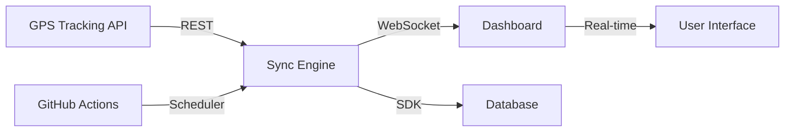

# 🚚 Fleet Management Automation System
## Real-Time Vehicle Tracking & Task Management Platform

[](https://github.com/Rusty0508/loctracker-dispatcher/actions)
[](https://www.python.org/)
[](https://reactjs.org/)
[](https://nodejs.org/)
[](LICENSE)

## 🎯 Project Overview

**Fleet Management Automation System** is a comprehensive solution that integrates real-time GPS tracking with intelligent task management. This system automates dispatcher operations and provides real-time visibility into fleet operations for transport companies.

### 🏆 Key Features
- **Full Automation**: Eliminates manual data entry 
- **Real-time Synchronization**: Cloud-based updates every 5 minutes
- **Zero Downtime**: Fully automated with GitHub Actions
- **Live Dashboard**: WebSocket-powered real-time updates
- **Multi-language Support**: Flexible interface localization

## 🚀 Core Capabilities

### 📊 Real-Time Fleet Dashboard
- **Live Vehicle Tracking**: GPS position monitoring
- **Interactive Maps**: Advanced visualization with clustering
- **Status Monitoring**: Engine state, speed, fuel levels
- **Driver Management**: Tachograph integration for compliance

### 🔄 Automated Data Synchronization
- **Bi-directional Integration**: GPS Tracker ↔ Database
- **Intelligent Field Mapping**: Multiple data points synchronized
- **Conflict Resolution**: Smart handling of data discrepancies
- **Error Recovery**: Automatic retry mechanisms

### 📈 Advanced Analytics
- **Fuel Monitoring**: Consumption tracking and analysis
- **Route Optimization**: Distance and ETA calculations
- **Utilization Metrics**: Fleet efficiency analysis
- **Task Management**: Automated assignment system

### 🔐 Enterprise Security
- **Secure API Integration**: Environment-based configuration
- **Protected Credentials**: GitHub Secrets management
- **Rate Limiting**: Intelligent request throttling
- **Audit Logging**: Complete operation history

## 🛠️ Technical Architecture

### Backend Stack
```python
# Core Technologies
- Python 3.10+ with Type Hints
- Async/Await patterns
- Modern SDK integrations
- RESTful API architecture
```

### Frontend Stack
```javascript
// Modern Web Application
- React 18.2 with Hooks
- Vite build system
- TailwindCSS styling
- Socket.io real-time communication
- Leaflet map visualization
```

### Infrastructure
```yaml
# Cloud-Native Deployment
- GitHub Actions CI/CD
- Automated scheduling
- Environment-based configuration
- Containerization ready
```

## 📊 System Architecture



## 🔧 Technical Implementation

### Data Processing Pipeline
The system processes multiple data streams:

| Source Data | Processing | Output |
|------------|------------|--------|
| GPS Coordinates | Geocoding | Location Info |
| Vehicle Metrics | Analysis | Performance KPIs |
| Driver Data | Compliance Check | Status Reports |
| Task Queue | Optimization | Assignments |

### Performance Optimization
- **Batch Processing**: Efficient multi-vehicle updates
- **Connection Pooling**: Optimized network usage
- **Caching Strategy**: Reduced API calls
- **Lazy Loading**: On-demand data fetching

## 🌟 Business Benefits

### Operational Efficiency
- **Significant reduction** in manual workload
- **Real-time visibility** into operations
- **Automated compliance** tracking
- **Instant alerts** for critical events

### Cost Optimization
- **Fuel efficiency** through analytics
- **Reduced idle time** via automation
- **Predictive maintenance** capabilities
- **Digital transformation** of processes

## 🚀 Deployment Guide

### Cloud Deployment (Recommended)
```bash
# Fork the repository
# Configure GitHub Secrets for API credentials
# Automation starts immediately upon setup
# Monitor via GitHub Actions dashboard
```

### Local Development
```bash
# Clone repository
git clone https://github.com/Rusty0508/loctracker-dispatcher.git
cd loctracker-dispatcher

# Backend setup
python3 -m venv venv
source venv/bin/activate
pip install -r requirements.txt

# Frontend setup
npm install
npm run dev

# Start services
npm run server  # Backend services
npm run client  # Frontend application
```

## 📈 Monitoring & Analytics

### System Monitoring
- Automated workflow execution
- Performance metrics tracking
- Error rate monitoring
- Health check dashboard

### Business Metrics
- Sync performance analytics
- API response monitoring
- Data accuracy validation
- System availability tracking

## 🔮 Roadmap

### Phase 1 - Core Features ✅
- Real-time tracking integration
- Database synchronization
- Dashboard development
- Automation setup

### Phase 2 - Enhancements (In Progress)
- Advanced analytics
- Mobile responsiveness
- Performance optimization
- Extended integrations

### Phase 3 - Future Vision
- Machine learning predictions
- Mobile applications
- Advanced reporting
- Multi-tenant architecture

## 🤝 Professional Implementation

This system represents a modern approach to fleet management automation, suitable for transport companies of any size looking to digitize their operations.

### Technologies Used
- Modern Python development
- React ecosystem
- Cloud-native architecture
- DevOps best practices

### Implementation Benefits
- Reduced operational costs
- Improved efficiency
- Better compliance management
- Enhanced decision making

## 📜 License

This project is licensed under the MIT License - see the [LICENSE](LICENSE) file for details.

## 🙏 Acknowledgments

- Open source community for excellent tools and libraries
- Modern cloud platforms enabling automated deployments
- Transport industry professionals for valuable insights

---

**Built with ❤️ for the Transport Industry**

*Transforming fleet management through intelligent automation*